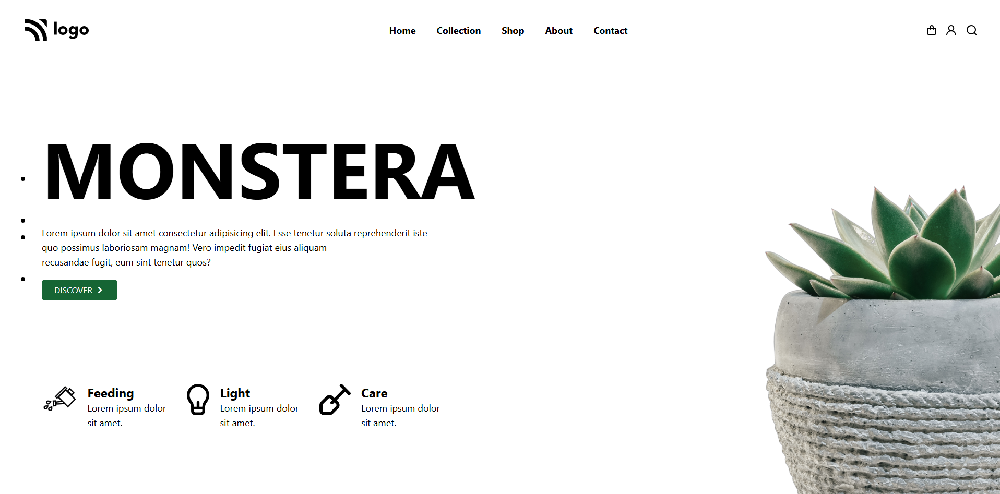
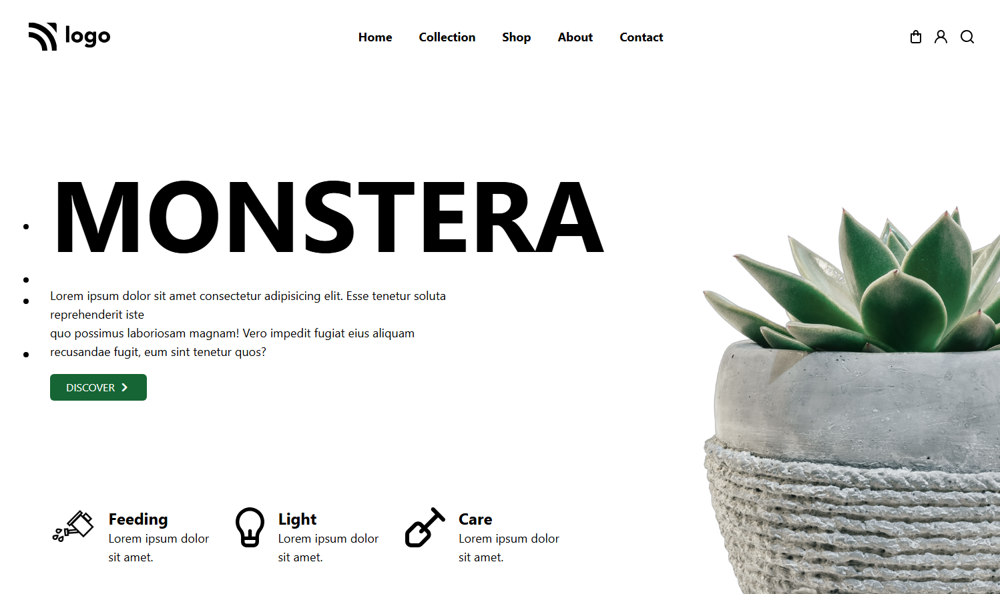
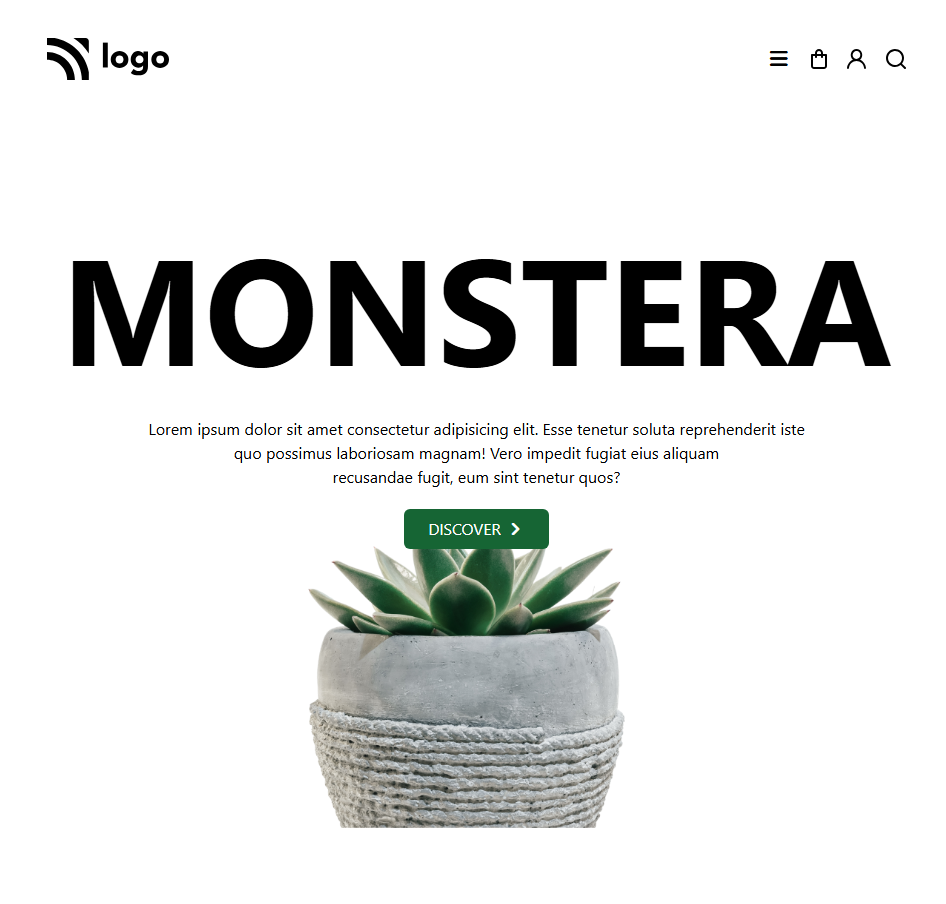
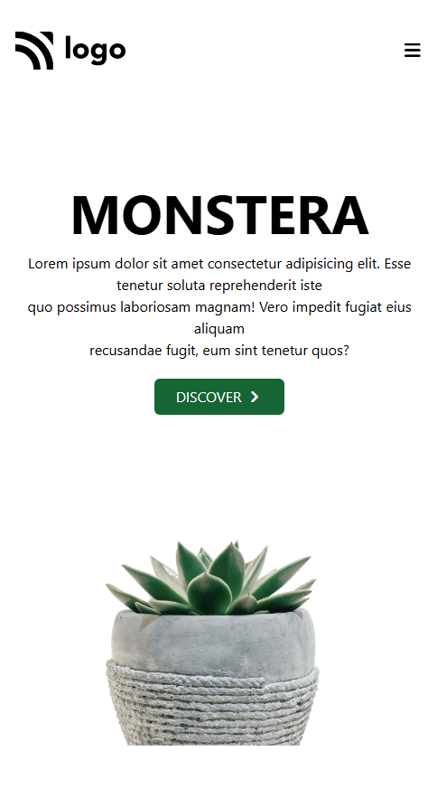

# 🌿 Monstera Landing Page

A modern, responsive landing page for a plant-themed website built using **HTML** and **Tailwind CSS**. This project showcases a stylish UI layout with responsive design, clean typography, and minimal aesthetics.

---

## 🚀 Features

* 📱 Fully responsive design (mobile, tablet, desktop)
* 🎨 Styled using **Tailwind CSS**
* 🌿 Plant-themed UI (Monstera concept)
* 🧭 Navigation bar with icons
* 🖼️ Hero section with large typography and imagery
* ⚡ Clean and minimal layout

---

## Live

[live](https://amrithaamzz.github.io/Monstera-Landing-Page/)

## SYSTEM SCREEN



## IPAD SCREEN



## TAB SCREEN



## MOBILE SCREEN




## 🛠️ Technologies Used

* **HTML5**
* **Tailwind CSS (CDN)**
* **Font Awesome Icons**

---

## 📂 Project Structure

```
monstera/
│
├── index.html
├── Logo.svg
├── cart.svg
├── user.svg
├── search.svg
├── cut flower.png
└── PlantHomePage/
    └── photos/
        ├── 6_folwer.png
        ├── springler.png
        ├── light.svg
        └── plough.svg
```

---

## 💻 How to Run

1. Download or clone the repository:

   ```bash
   git clone https://github.com/amrithaamzz/monstera.git
   ```

2. Open the project folder.

3. Run the `index.html` file in your browser.

---

## 📸 Preview

* Large **MONSTERA** heading
* Decorative plant images
* Feature highlights (Feeding, Light, Care)

---

## 🎯 Purpose

This project is ideal for:

* Practicing **Tailwind CSS**
* Building responsive layouts
* Creating modern landing pages

---

## 📌 Future Improvements

* Add mobile menu functionality
* Include animations/transitions
* Convert to React or Next.js
* Add real product/shop section

---

## 📄 License

This project is open-source and free to use.

## Author

   AMRITHA MOHANAN